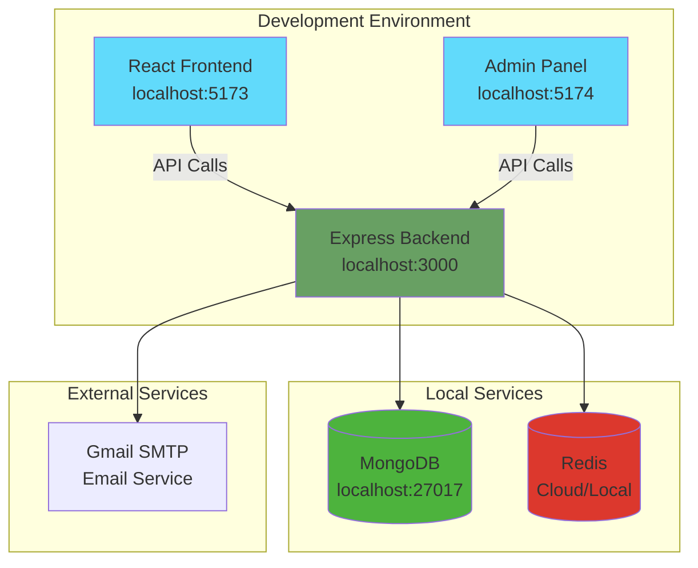

# 👨‍💻 Developer Onboarding Guide

Welcome to the **IP Getter** project! This comprehensive guide will help you get up and running quickly with our full-stack authentication system.

## 🎯 Project Overview

IP Getter is a modern full-stack web application featuring:
- **Backend**: Node.js/Express with MongoDB and Redis
- **Frontend**: React with Redux Toolkit and Tailwind CSS
- **Admin Panel**: Separate React application for administration
- **Authentication**: JWT-based with email verification
- **Security**: HTTP-only cookies, password hashing, OTP verification

## 🏗️ Architecture Overview



## 🛠️ Prerequisites

### Required Software
- **Node.js** 18+ ([Download](https://nodejs.org/))
- **MongoDB** 6+ ([Download](https://www.mongodb.com/try/download/community))
- **Redis** 7+ ([Download](https://redis.io/download) or use [Redis Cloud](https://redis.com/))
- **Git** ([Download](https://git-scm.com/))
- **VS Code** (Recommended) ([Download](https://code.visualstudio.com/))

### Recommended VS Code Extensions
```json
{
  "recommendations": [
    "bradlc.vscode-tailwindcss",
    "esbenp.prettier-vscode",
    "ms-vscode.vscode-json",
    "ms-vscode.vscode-typescript-next",
    "formulahendry.auto-rename-tag",
    "christian-kohler.path-intellisense",
    "ms-vscode.vscode-eslint"
  ]
}
```

### Gmail Setup for Email Service
1. Enable 2-Factor Authentication on your Gmail account
2. Generate an App Password:
   - Go to Google Account Settings
   - Security → 2-Step Verification → App passwords
   - Generate password for "Mail"
   - Save this password for environment variables

## 🚀 Quick Setup

### 1. Clone and Navigate
```bash
git clone <repository-url>
cd aaresu
```

### 2. Backend Setup
```bash
cd backend
npm install

# Create environment file
cp .env.example .env
```

**Edit `.env` file:**
```env
PORT=3000
MONGO_URI=mongodb://localhost:27017/ipgetter
JWT_SECRET=your-super-secret-jwt-key-minimum-32-characters
EMAIL=your-gmail@gmail.com
EMAIL_PASS=your-gmail-app-password
REDIS_URL=your-redis-url
REDIS_PASSWORD=your-redis-password
REDIS_PORT=your-redis-port
REDIS_USERNAME=your-redis-username
```

### 3. Frontend Setup
```bash
cd ../frontend
npm install

# Create environment file
echo "VITE_API_URL=http://localhost:3000/api" > .env
```

### 4. Admin Panel Setup (Optional)
```bash
cd ../admin
npm install

# Create environment file
echo "VITE_API_URL=http://localhost:3000/api" > .env
```

### 5. Start Development Servers

**Terminal 1 - Backend:**
```bash
cd backend
npm start
# Server running on http://localhost:3000
```

**Terminal 2 - Frontend:**
```bash
cd frontend
npm run dev
# Frontend running on http://localhost:5173
```

**Terminal 3 - Admin (Optional):**
```bash
cd admin
npm run dev
# Admin panel running on http://localhost:5174
```

## 📁 Project Structure Deep Dive

```
aaresu/
├── 📁 backend/                 # Node.js API Server
│   ├── 📁 src/
│   │   ├── 📁 config/         # Configuration files
│   │   │   ├── connectDB.js   # MongoDB connection
│   │   │   ├── redisClient.js # Redis connection
│   │   │   └── env.js         # Environment validation
│   │   ├── 📁 controllers/    # Request handlers
│   │   │   ├── auth.controller.js
│   │   │   └── verifyOtp.js
│   │   ├── 📁 dao/           # Data Access Objects
│   │   │   └── user.dao.js
│   │   ├── 📁 middlewares/   # Express middlewares
│   │   │   ├── auth.middleware.js
│   │   │   └── requestLogger.js
│   │   ├── 📁 models/        # MongoDB schemas
│   │   │   └── user.model.js
│   │   ├── 📁 routes/        # API route definitions
│   │   │   ├── authRoutes.js
│   │   │   └── protectedRoutes.js
│   │   ├── 📁 services/      # Business logic
│   │   │   └── auth.service.js
│   │   ├── 📁 utils/         # Helper functions
│   │   │   ├── asyncHandler.js
│   │   │   ├── hashPassword.js
│   │   │   ├── jwtToken.js
│   │   │   ├── otp.js
│   │   │   └── sendEmail.js
│   │   └── 📄 app.js         # Express app configuration
│   ├── 📄 server.js          # Server entry point
│   └── 📄 package.json       # Backend dependencies
├── 📁 frontend/               # React Client Application
│   ├── 📁 src/
│   │   ├── 📁 components/    # Reusable UI components
│   │   │   ├── Header.jsx
│   │   │   ├── LogoutButton.jsx
│   │   │   ├── ProtectedRoute.jsx
│   │   │   └── 📁 ui/        # Base UI components
│   │   ├── 📁 pages/         # Page components
│   │   │   ├── HomePage.jsx
│   │   │   ├── LoginPage.jsx
│   │   │   ├── RegisterPage.jsx
│   │   │   └── ForgetPassword.jsx
│   │   ├── 📁 redux/         # State management
│   │   │   ├── 📁 auth/      # Auth slice and thunks
│   │   │   ├── store.js
│   │   │   └── rootReducer.js
│   │   ├── 📁 hooks/         # Custom React hooks
│   │   │   └── useAuth.js
│   │   ├── 📁 axios/         # API configuration
│   │   │   └── apiInstance.js
│   │   ├── 📁 routes/        # Client-side routing
│   │   │   └── RootRoutes.jsx
│   │   └── 📁 utils/         # Utility functions
│   │       └── ProtectRoute.js
│   └── 📄 package.json       # Frontend dependencies
└── 📁 admin/                  # Admin Panel (separate React app)
    └── 📁 src/               # Admin-specific components
```

## 🔄 Development Workflow

### Daily Development Process

```mermaid
flowchart TD
    START([Start Development]) --> PULL[git pull origin main]
    PULL --> BRANCH[git checkout -b feature/your-feature]
    BRANCH --> CODE[Write Code]
    CODE --> TEST[Run Tests]
    TEST --> COMMIT[git commit -m "feat: description"]
    COMMIT --> PUSH[git push origin feature/your-feature]
    PUSH --> PR[Create Pull Request]
    PR --> REVIEW[Code Review]
    REVIEW --> MERGE[Merge to Main]
    MERGE --> CLEANUP[Delete Feature Branch]
    
    style START fill:#4caf50
    style MERGE fill:#2196f3
    style CLEANUP fill:#ff9800
```

### Git Workflow
```bash
# 1. Start new feature
git checkout main
git pull origin main
git checkout -b feature/your-feature-name

# 2. Make changes and commit
git add .
git commit -m "feat: add new authentication feature"

# 3. Push and create PR
git push origin feature/your-feature-name
# Create Pull Request on GitHub

# 4. After merge, cleanup
git checkout main
git pull origin main
git branch -d feature/your-feature-name
```

## 🧪 Testing Your Setup

### 1. Backend Health Check
```bash
curl http://localhost:3000/api/health
# Expected: {"success": true, "message": "Server is running"}
```

### 2. Database Connection
Check MongoDB connection in backend logs:
```
✅ MongoDB connected successfully
✅ Redis connected successfully
🚀 Server running on port 3000
```

### 3. Frontend Access
- Visit: http://localhost:5173
- Should show login page or redirect to login
- Register a new user to test email functionality

### 4. Full Authentication Flow Test
1. Register new user → Should receive OTP email
2. Verify OTP → Should redirect to dashboard
3. Refresh page → Should stay logged in
4. Logout → Should clear session and redirect to login

## 🔧 Common Development Tasks

### Adding New API Endpoint
1. **Create route** in `backend/src/routes/`
2. **Add controller** in `backend/src/controllers/`
3. **Add service logic** in `backend/src/services/`
4. **Update DAO** if database access needed
5. **Add middleware** if protection needed
6. **Test endpoint** with Postman/curl

### Adding New Frontend Page
1. **Create page component** in `frontend/src/pages/`
2. **Add route** in `frontend/src/routes/RootRoutes.jsx`
3. **Add navigation** in Header component
4. **Connect to Redux** if state needed
5. **Style with Tailwind CSS**

### Database Operations
```bash
# Connect to MongoDB
mongosh mongodb://localhost:27017/ipgetter

# View users
db.users.find().pretty()

# Clear all users (development only)
db.users.deleteMany({})
```

### Redis Operations
```bash
# Connect to Redis
redis-cli

# View all keys
KEYS *

# View OTP for email
GET "otp:user@example.com"

# Clear all OTPs
FLUSHDB
```

## 🐛 Debugging Tips

### Backend Debugging
- **Check logs**: Console output shows detailed error messages
- **MongoDB issues**: Verify connection string and database running
- **Redis issues**: Check Redis connection and credentials
- **Email issues**: Verify Gmail app password and settings

### Frontend Debugging
- **Network tab**: Check API requests and responses
- **Redux DevTools**: Install browser extension for state debugging
- **Console errors**: Check browser console for JavaScript errors
- **Authentication issues**: Check cookies in Application tab

### Common Issues and Solutions

| Issue | Solution |
|-------|----------|
| CORS errors | Check `withCredentials: true` in axios config |
| Token not persisting | Verify cookie settings and domain |
| Email not sending | Check Gmail app password and SMTP settings |
| Database connection failed | Ensure MongoDB is running and connection string is correct |
| Redis connection failed | Verify Redis credentials and network access |

## 📚 Learning Resources

### Project-Specific
- [Authentication Flow Guide](AUTHENTICATION_FLOW.md)
- [API Documentation](API_DOCUMENTATION.md)
- [System Diagrams](SYSTEM_DIAGRAMS.md)

### Technology Stack
- **Node.js**: [Official Docs](https://nodejs.org/docs/)
- **Express.js**: [Express Guide](https://expressjs.com/en/guide/)
- **React**: [React Docs](https://react.dev/)
- **Redux Toolkit**: [RTK Docs](https://redux-toolkit.js.org/)
- **MongoDB**: [MongoDB Manual](https://docs.mongodb.com/)
- **Tailwind CSS**: [Tailwind Docs](https://tailwindcss.com/docs)

## 🎯 Next Steps

After completing setup:
1. **Explore the codebase** - Read through key files
2. **Run the test suite** - Understand testing patterns
3. **Make a small change** - Add a simple feature
4. **Read documentation** - Understand architecture decisions
5. **Join team discussions** - Ask questions and contribute ideas

## 🤝 Contributing Guidelines

### Code Style
- Use **ESLint** and **Prettier** for consistent formatting
- Follow **conventional commits** for commit messages
- Write **meaningful variable names** and comments
- Keep **functions small** and focused

### Pull Request Process
1. Create feature branch from `main`
2. Write tests for new functionality
3. Update documentation if needed
4. Ensure all tests pass
5. Request code review
6. Address feedback and merge

Welcome to the team! 🎉 If you have any questions, don't hesitate to ask.
