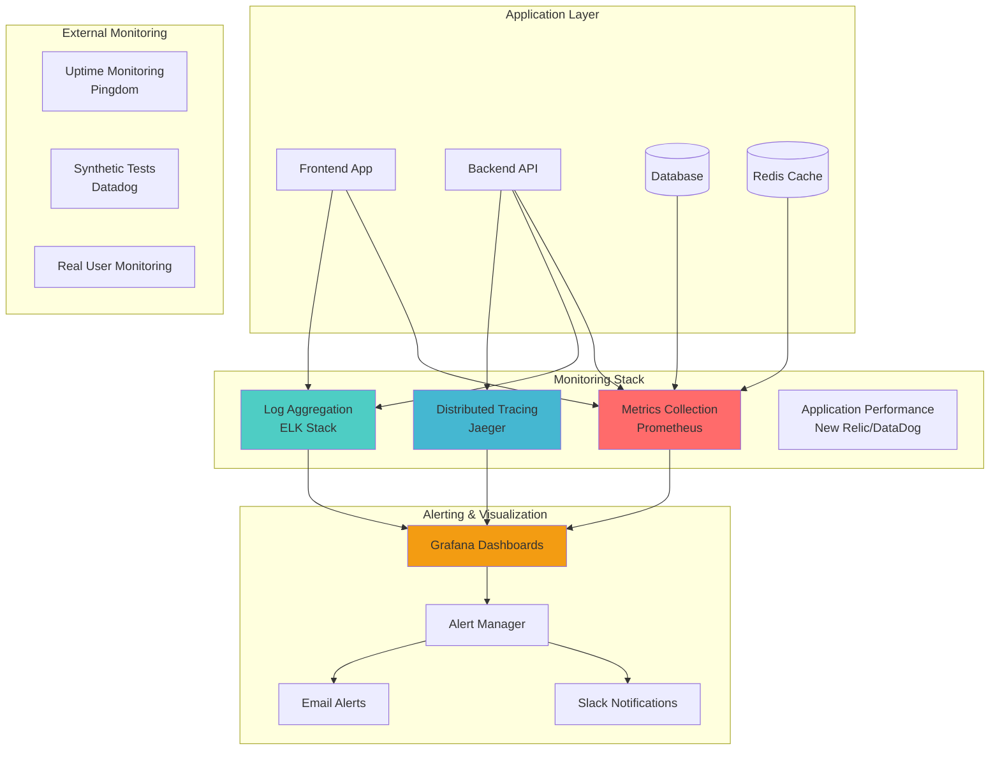
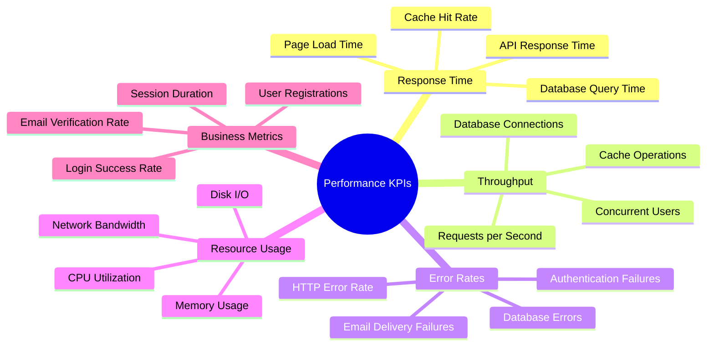

# 📊 Monitoring & Performance Guide

## 🎯 Monitoring Strategy Overview

This guide covers comprehensive monitoring, performance optimization, and observability practices for the IP Getter project.

## 🏗️ Monitoring Architecture



## 📈 Key Performance Indicators (KPIs)

### Application Metrics



### Critical Metrics to Monitor

| Metric | Target | Alert Threshold | Description |
|--------|--------|-----------------|-------------|
| **API Response Time** | < 200ms | > 500ms | Average response time for API endpoints |
| **Error Rate** | < 1% | > 5% | Percentage of failed requests |
| **Database Query Time** | < 100ms | > 300ms | Average database query execution time |
| **Cache Hit Rate** | > 90% | < 80% | Redis cache hit percentage |
| **CPU Usage** | < 70% | > 85% | Server CPU utilization |
| **Memory Usage** | < 80% | > 90% | Server memory utilization |
| **Uptime** | 99.9% | < 99% | Service availability |

## 🔧 Monitoring Implementation

### Backend Monitoring Setup

#### Prometheus Metrics Collection
```javascript
// src/middlewares/metrics.middleware.js
const promClient = require('prom-client');

// Create metrics registry
const register = new promClient.Registry();

// HTTP request duration histogram
const httpRequestDuration = new promClient.Histogram({
  name: 'http_request_duration_seconds',
  help: 'Duration of HTTP requests in seconds',
  labelNames: ['method', 'route', 'status_code'],
  buckets: [0.1, 0.3, 0.5, 0.7, 1, 3, 5, 7, 10]
});

// HTTP request counter
const httpRequestTotal = new promClient.Counter({
  name: 'http_requests_total',
  help: 'Total number of HTTP requests',
  labelNames: ['method', 'route', 'status_code']
});

// Database query duration
const dbQueryDuration = new promClient.Histogram({
  name: 'db_query_duration_seconds',
  help: 'Duration of database queries in seconds',
  labelNames: ['operation', 'collection']
});

// Redis operations
const redisOperations = new promClient.Counter({
  name: 'redis_operations_total',
  help: 'Total number of Redis operations',
  labelNames: ['operation', 'status']
});

// Register metrics
register.registerMetric(httpRequestDuration);
register.registerMetric(httpRequestTotal);
register.registerMetric(dbQueryDuration);
register.registerMetric(redisOperations);

// Middleware to collect HTTP metrics
const collectHttpMetrics = (req, res, next) => {
  const start = Date.now();
  
  res.on('finish', () => {
    const duration = (Date.now() - start) / 1000;
    const route = req.route ? req.route.path : req.path;
    
    httpRequestDuration
      .labels(req.method, route, res.statusCode)
      .observe(duration);
    
    httpRequestTotal
      .labels(req.method, route, res.statusCode)
      .inc();
  });
  
  next();
};

module.exports = {
  register,
  collectHttpMetrics,
  dbQueryDuration,
  redisOperations
};
```

#### Health Check with Detailed Status
```javascript
// src/routes/healthRoutes.js
const express = require('express');
const mongoose = require('mongoose');
const redisClient = require('../config/redisClient');
const { register } = require('../middlewares/metrics.middleware');

const router = express.Router();

router.get('/health', async (req, res) => {
  const healthCheck = {
    uptime: process.uptime(),
    message: 'Server is running',
    timestamp: new Date(),
    environment: process.env.NODE_ENV,
    version: process.env.npm_package_version,
    services: {},
    metrics: {
      memory: process.memoryUsage(),
      cpu: process.cpuUsage()
    }
  };

  try {
    // Check MongoDB
    await mongoose.connection.db.admin().ping();
    healthCheck.services.mongodb = {
      status: 'healthy',
      responseTime: Date.now()
    };
  } catch (error) {
    healthCheck.services.mongodb = {
      status: 'unhealthy',
      error: error.message
    };
  }

  try {
    // Check Redis
    const start = Date.now();
    await redisClient.ping();
    healthCheck.services.redis = {
      status: 'healthy',
      responseTime: Date.now() - start
    };
  } catch (error) {
    healthCheck.services.redis = {
      status: 'unhealthy',
      error: error.message
    };
  }

  const isHealthy = Object.values(healthCheck.services)
    .every(service => service.status === 'healthy');
  
  res.status(isHealthy ? 200 : 503).json(healthCheck);
});

// Metrics endpoint for Prometheus
router.get('/metrics', async (req, res) => {
  res.set('Content-Type', register.contentType);
  res.end(await register.metrics());
});

module.exports = router;
```

### Frontend Performance Monitoring

#### Web Vitals Tracking
```javascript
// src/utils/performanceMonitoring.js
import { getCLS, getFID, getFCP, getLCP, getTTFB } from 'web-vitals';

const sendToAnalytics = (metric) => {
  // Send to your analytics service
  console.log('Performance metric:', metric);
  
  // Example: Send to Google Analytics
  if (window.gtag) {
    window.gtag('event', metric.name, {
      event_category: 'Web Vitals',
      event_label: metric.id,
      value: Math.round(metric.name === 'CLS' ? metric.value * 1000 : metric.value),
      non_interaction: true,
    });
  }
};

// Measure and report Web Vitals
export const initPerformanceMonitoring = () => {
  getCLS(sendToAnalytics);
  getFID(sendToAnalytics);
  getFCP(sendToAnalytics);
  getLCP(sendToAnalytics);
  getTTFB(sendToAnalytics);
};

// Custom performance tracking
export const trackPageLoad = (pageName) => {
  const navigationEntry = performance.getEntriesByType('navigation')[0];
  
  const metrics = {
    page: pageName,
    loadTime: navigationEntry.loadEventEnd - navigationEntry.loadEventStart,
    domContentLoaded: navigationEntry.domContentLoadedEventEnd - navigationEntry.domContentLoadedEventStart,
    firstByte: navigationEntry.responseStart - navigationEntry.requestStart,
    timestamp: new Date().toISOString()
  };
  
  console.log('Page load metrics:', metrics);
  // Send to monitoring service
};

// API call performance tracking
export const trackApiCall = (endpoint, duration, status) => {
  const metric = {
    type: 'api_call',
    endpoint,
    duration,
    status,
    timestamp: new Date().toISOString()
  };
  
  console.log('API call metric:', metric);
  // Send to monitoring service
};
```

#### Error Boundary with Monitoring
```javascript
// src/components/ErrorBoundary.jsx
import React from 'react';

class ErrorBoundary extends React.Component {
  constructor(props) {
    super(props);
    this.state = { hasError: false, error: null, errorInfo: null };
  }

  static getDerivedStateFromError(error) {
    return { hasError: true };
  }

  componentDidCatch(error, errorInfo) {
    this.setState({
      error: error,
      errorInfo: errorInfo
    });

    // Log error to monitoring service
    this.logErrorToService(error, errorInfo);
  }

  logErrorToService = (error, errorInfo) => {
    const errorData = {
      message: error.message,
      stack: error.stack,
      componentStack: errorInfo.componentStack,
      timestamp: new Date().toISOString(),
      userAgent: navigator.userAgent,
      url: window.location.href
    };

    console.error('React Error Boundary:', errorData);
    
    // Send to error tracking service (e.g., Sentry)
    if (window.Sentry) {
      window.Sentry.captureException(error, {
        contexts: {
          react: {
            componentStack: errorInfo.componentStack
          }
        }
      });
    }
  };

  render() {
    if (this.state.hasError) {
      return (
        <div className="min-h-screen flex items-center justify-center bg-gray-50">
          <div className="max-w-md w-full bg-white shadow-lg rounded-lg p-6">
            <div className="flex items-center mb-4">
              <div className="flex-shrink-0">
                <svg className="h-8 w-8 text-red-400" fill="none" viewBox="0 0 24 24" stroke="currentColor">
                  <path strokeLinecap="round" strokeLinejoin="round" strokeWidth={2} d="M12 9v2m0 4h.01m-6.938 4h13.856c1.54 0 2.502-1.667 1.732-2.5L13.732 4c-.77-.833-1.964-.833-2.732 0L3.732 16.5c-.77.833.192 2.5 1.732 2.5z" />
                </svg>
              </div>
              <div className="ml-3">
                <h3 className="text-sm font-medium text-gray-800">
                  Something went wrong
                </h3>
              </div>
            </div>
            <div className="text-sm text-gray-600">
              <p>We're sorry, but something unexpected happened. Please try refreshing the page.</p>
            </div>
            <div className="mt-4">
              <button
                onClick={() => window.location.reload()}
                className="w-full bg-blue-600 text-white py-2 px-4 rounded-md hover:bg-blue-700 focus:outline-none focus:ring-2 focus:ring-blue-500"
              >
                Refresh Page
              </button>
            </div>
          </div>
        </div>
      );
    }

    return this.props.children;
  }
}

export default ErrorBoundary;
```

## 📊 Dashboard Configuration

### Grafana Dashboard JSON
```json
{
  "dashboard": {
    "title": "IP Getter Application Dashboard",
    "panels": [
      {
        "title": "API Response Time",
        "type": "graph",
        "targets": [
          {
            "expr": "histogram_quantile(0.95, rate(http_request_duration_seconds_bucket[5m]))",
            "legendFormat": "95th percentile"
          },
          {
            "expr": "histogram_quantile(0.50, rate(http_request_duration_seconds_bucket[5m]))",
            "legendFormat": "50th percentile"
          }
        ]
      },
      {
        "title": "Request Rate",
        "type": "graph",
        "targets": [
          {
            "expr": "rate(http_requests_total[5m])",
            "legendFormat": "{{method}} {{route}}"
          }
        ]
      },
      {
        "title": "Error Rate",
        "type": "singlestat",
        "targets": [
          {
            "expr": "rate(http_requests_total{status_code=~\"5..\"}[5m]) / rate(http_requests_total[5m]) * 100"
          }
        ]
      },
      {
        "title": "Database Query Performance",
        "type": "graph",
        "targets": [
          {
            "expr": "histogram_quantile(0.95, rate(db_query_duration_seconds_bucket[5m]))",
            "legendFormat": "{{operation}} - 95th percentile"
          }
        ]
      }
    ]
  }
}
```

## 🚨 Alerting Configuration

### Alert Rules
```yaml
# alerting-rules.yml
groups:
  - name: ip-getter-alerts
    rules:
      - alert: HighErrorRate
        expr: rate(http_requests_total{status_code=~"5.."}[5m]) / rate(http_requests_total[5m]) > 0.05
        for: 2m
        labels:
          severity: critical
        annotations:
          summary: "High error rate detected"
          description: "Error rate is {{ $value | humanizePercentage }} for the last 5 minutes"

      - alert: HighResponseTime
        expr: histogram_quantile(0.95, rate(http_request_duration_seconds_bucket[5m])) > 0.5
        for: 5m
        labels:
          severity: warning
        annotations:
          summary: "High response time detected"
          description: "95th percentile response time is {{ $value }}s"

      - alert: DatabaseConnectionFailure
        expr: up{job="mongodb"} == 0
        for: 1m
        labels:
          severity: critical
        annotations:
          summary: "Database connection failure"
          description: "MongoDB is not responding"

      - alert: RedisConnectionFailure
        expr: up{job="redis"} == 0
        for: 1m
        labels:
          severity: warning
        annotations:
          summary: "Redis connection failure"
          description: "Redis cache is not responding"

      - alert: HighMemoryUsage
        expr: (node_memory_MemTotal_bytes - node_memory_MemAvailable_bytes) / node_memory_MemTotal_bytes > 0.9
        for: 5m
        labels:
          severity: warning
        annotations:
          summary: "High memory usage"
          description: "Memory usage is above 90%"
```

### Slack Integration
```javascript
// src/utils/alerting.js
const axios = require('axios');

const sendSlackAlert = async (alert) => {
  const webhookUrl = process.env.SLACK_WEBHOOK_URL;
  
  if (!webhookUrl) {
    console.warn('Slack webhook URL not configured');
    return;
  }

  const message = {
    text: `🚨 Alert: ${alert.title}`,
    attachments: [
      {
        color: alert.severity === 'critical' ? 'danger' : 'warning',
        fields: [
          {
            title: 'Description',
            value: alert.description,
            short: false
          },
          {
            title: 'Severity',
            value: alert.severity,
            short: true
          },
          {
            title: 'Timestamp',
            value: new Date().toISOString(),
            short: true
          }
        ]
      }
    ]
  };

  try {
    await axios.post(webhookUrl, message);
    console.log('Alert sent to Slack successfully');
  } catch (error) {
    console.error('Failed to send alert to Slack:', error.message);
  }
};

module.exports = { sendSlackAlert };
```

## 🔍 Log Management

### Structured Logging
```javascript
// src/utils/logger.js
const winston = require('winston');

const logger = winston.createLogger({
  level: process.env.LOG_LEVEL || 'info',
  format: winston.format.combine(
    winston.format.timestamp(),
    winston.format.errors({ stack: true }),
    winston.format.json(),
    winston.format.printf(({ timestamp, level, message, ...meta }) => {
      return JSON.stringify({
        timestamp,
        level,
        message,
        service: 'ip-getter-api',
        environment: process.env.NODE_ENV,
        ...meta
      });
    })
  ),
  defaultMeta: { 
    service: 'ip-getter-api',
    version: process.env.npm_package_version 
  },
  transports: [
    new winston.transports.File({ 
      filename: 'logs/error.log', 
      level: 'error' 
    }),
    new winston.transports.File({ 
      filename: 'logs/combined.log' 
    }),
    new winston.transports.Console({
      format: winston.format.combine(
        winston.format.colorize(),
        winston.format.simple()
      )
    })
  ]
});

// Log HTTP requests
const logRequest = (req, res, next) => {
  const start = Date.now();
  
  res.on('finish', () => {
    const duration = Date.now() - start;
    
    logger.info('HTTP Request', {
      method: req.method,
      url: req.url,
      statusCode: res.statusCode,
      duration,
      userAgent: req.get('User-Agent'),
      ip: req.ip,
      userId: req.user?.id
    });
  });
  
  next();
};

module.exports = { logger, logRequest };
```

## 📱 Real User Monitoring (RUM)

### Frontend RUM Implementation
```javascript
// src/utils/rum.js
class RealUserMonitoring {
  constructor() {
    this.sessionId = this.generateSessionId();
    this.userId = null;
    this.startTime = Date.now();
    this.events = [];
  }

  generateSessionId() {
    return 'session_' + Math.random().toString(36).substr(2, 9);
  }

  setUserId(userId) {
    this.userId = userId;
  }

  trackPageView(pageName) {
    this.trackEvent('page_view', {
      page: pageName,
      url: window.location.href,
      referrer: document.referrer,
      timestamp: Date.now()
    });
  }

  trackUserAction(action, details = {}) {
    this.trackEvent('user_action', {
      action,
      ...details,
      timestamp: Date.now()
    });
  }

  trackError(error, context = {}) {
    this.trackEvent('error', {
      message: error.message,
      stack: error.stack,
      context,
      timestamp: Date.now()
    });
  }

  trackPerformance(metric) {
    this.trackEvent('performance', {
      ...metric,
      timestamp: Date.now()
    });
  }

  trackEvent(type, data) {
    const event = {
      type,
      sessionId: this.sessionId,
      userId: this.userId,
      ...data
    };

    this.events.push(event);
    
    // Send to monitoring service
    this.sendEvent(event);
  }

  async sendEvent(event) {
    try {
      await fetch('/api/monitoring/events', {
        method: 'POST',
        headers: {
          'Content-Type': 'application/json'
        },
        body: JSON.stringify(event)
      });
    } catch (error) {
      console.error('Failed to send monitoring event:', error);
    }
  }

  getSessionSummary() {
    return {
      sessionId: this.sessionId,
      userId: this.userId,
      duration: Date.now() - this.startTime,
      eventCount: this.events.length,
      events: this.events
    };
  }
}

// Initialize RUM
const rum = new RealUserMonitoring();

// Track page visibility changes
document.addEventListener('visibilitychange', () => {
  if (document.hidden) {
    rum.trackEvent('page_hidden', { timestamp: Date.now() });
  } else {
    rum.trackEvent('page_visible', { timestamp: Date.now() });
  }
});

// Track unload events
window.addEventListener('beforeunload', () => {
  const summary = rum.getSessionSummary();
  navigator.sendBeacon('/api/monitoring/session-end', JSON.stringify(summary));
});

export default rum;
```

This comprehensive monitoring guide provides the foundation for maintaining visibility into your application's performance, health, and user experience.
