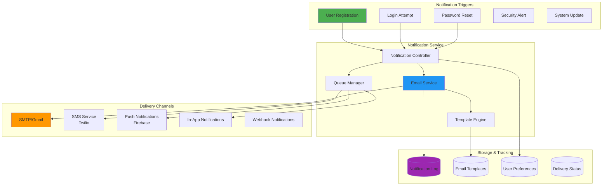
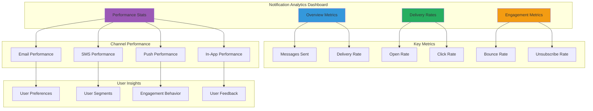

# 📧 Notification System Documentation

## 🎯 Overview

The IP Getter notification system handles various types of user communications including email verification, authentication alerts, and system notifications. This document covers the current implementation and future expansion plans.

## 🏗️ Notification Architecture



## 📧 Current Email System

### Email Service Implementation

```javascript
// src/services/email.service.js
const nodemailer = require('nodemailer');
const fs = require('fs').promises;
const path = require('path');
const handlebars = require('handlebars');

class EmailService {
  constructor() {
    this.transporter = this.createTransporter();
    this.templates = new Map();
  }

  createTransporter() {
    return nodemailer.createTransporter({
      service: 'gmail',
      auth: {
        user: process.env.EMAIL,
        pass: process.env.EMAIL_PASS
      },
      pool: true,
      maxConnections: 5,
      maxMessages: 100,
      rateLimit: 14 // messages per second
    });
  }

  async loadTemplate(templateName) {
    if (this.templates.has(templateName)) {
      return this.templates.get(templateName);
    }

    try {
      const templatePath = path.join(__dirname, '../templates/email', `${templateName}.hbs`);
      const templateContent = await fs.readFile(templatePath, 'utf8');
      const compiledTemplate = handlebars.compile(templateContent);
      
      this.templates.set(templateName, compiledTemplate);
      return compiledTemplate;
    } catch (error) {
      console.error(`Failed to load email template: ${templateName}`, error);
      throw new Error(`Email template not found: ${templateName}`);
    }
  }

  async sendEmail(options) {
    const {
      to,
      subject,
      template,
      data = {},
      attachments = []
    } = options;

    try {
      let html;
      
      if (template) {
        const compiledTemplate = await this.loadTemplate(template);
        html = compiledTemplate(data);
      } else {
        html = data.html || data.text;
      }

      const mailOptions = {
        from: {
          name: 'IP Getter',
          address: process.env.EMAIL
        },
        to,
        subject,
        html,
        attachments
      };

      const result = await this.transporter.sendMail(mailOptions);
      
      // Log successful email
      console.log('Email sent successfully:', {
        messageId: result.messageId,
        to,
        subject,
        template
      });

      return {
        success: true,
        messageId: result.messageId,
        response: result.response
      };
    } catch (error) {
      console.error('Failed to send email:', error);
      throw new Error(`Email delivery failed: ${error.message}`);
    }
  }

  async sendVerificationOTP(email, otp, username) {
    return this.sendEmail({
      to: email,
      subject: 'Verify Your Email - IP Getter',
      template: 'verification-otp',
      data: {
        username,
        otp,
        expiryMinutes: 5,
        supportEmail: process.env.SUPPORT_EMAIL || process.env.EMAIL
      }
    });
  }

  async sendWelcomeEmail(email, username) {
    return this.sendEmail({
      to: email,
      subject: 'Welcome to IP Getter!',
      template: 'welcome',
      data: {
        username,
        loginUrl: `${process.env.FRONTEND_URL}/login`,
        supportEmail: process.env.SUPPORT_EMAIL || process.env.EMAIL
      }
    });
  }

  async sendPasswordResetOTP(email, otp, username) {
    return this.sendEmail({
      to: email,
      subject: 'Password Reset Request - IP Getter',
      template: 'password-reset',
      data: {
        username,
        otp,
        expiryMinutes: 5,
        supportEmail: process.env.SUPPORT_EMAIL || process.env.EMAIL
      }
    });
  }

  async sendSecurityAlert(email, alertData) {
    return this.sendEmail({
      to: email,
      subject: 'Security Alert - IP Getter',
      template: 'security-alert',
      data: {
        ...alertData,
        timestamp: new Date().toISOString(),
        supportEmail: process.env.SUPPORT_EMAIL || process.env.EMAIL
      }
    });
  }

  async verifyConnection() {
    try {
      await this.transporter.verify();
      console.log('✅ Email service connection verified');
      return true;
    } catch (error) {
      console.error('❌ Email service connection failed:', error);
      return false;
    }
  }
}

module.exports = new EmailService();
```

### Email Templates

#### Verification OTP Template (`src/templates/email/verification-otp.hbs`)
```html
<!DOCTYPE html>
<html>
<head>
    <meta charset="utf-8">
    <meta name="viewport" content="width=device-width, initial-scale=1.0">
    <title>Email Verification - IP Getter</title>
    <style>
        body { font-family: Arial, sans-serif; line-height: 1.6; color: #333; }
        .container { max-width: 600px; margin: 0 auto; padding: 20px; }
        .header { background: #2563eb; color: white; padding: 20px; text-align: center; }
        .content { padding: 30px; background: #f9fafb; }
        .otp-box { background: #1f2937; color: white; padding: 20px; text-align: center; font-size: 32px; font-weight: bold; letter-spacing: 8px; margin: 20px 0; border-radius: 8px; }
        .footer { padding: 20px; text-align: center; color: #6b7280; font-size: 14px; }
        .button { display: inline-block; background: #2563eb; color: white; padding: 12px 24px; text-decoration: none; border-radius: 6px; margin: 10px 0; }
    </style>
</head>
<body>
    <div class="container">
        <div class="header">
            <h1>🔐 Email Verification</h1>
        </div>
        
        <div class="content">
            <h2>Hello {{username}}!</h2>
            
            <p>Thank you for registering with IP Getter. To complete your registration, please verify your email address using the OTP below:</p>
            
            <div class="otp-box">
                {{otp}}
            </div>
            
            <p><strong>Important:</strong></p>
            <ul>
                <li>This OTP will expire in {{expiryMinutes}} minutes</li>
                <li>Do not share this code with anyone</li>
                <li>If you didn't request this, please ignore this email</li>
            </ul>
            
            <p>If you have any questions, please contact our support team at <a href="mailto:{{supportEmail}}">{{supportEmail}}</a></p>
        </div>
        
        <div class="footer">
            <p>© 2024 IP Getter. All rights reserved.</p>
            <p>This is an automated message, please do not reply to this email.</p>
        </div>
    </div>
</body>
</html>
```

#### Welcome Email Template (`src/templates/email/welcome.hbs`)
```html
<!DOCTYPE html>
<html>
<head>
    <meta charset="utf-8">
    <meta name="viewport" content="width=device-width, initial-scale=1.0">
    <title>Welcome to IP Getter</title>
    <style>
        body { font-family: Arial, sans-serif; line-height: 1.6; color: #333; }
        .container { max-width: 600px; margin: 0 auto; padding: 20px; }
        .header { background: linear-gradient(135deg, #667eea 0%, #764ba2 100%); color: white; padding: 30px; text-align: center; }
        .content { padding: 30px; background: #ffffff; }
        .feature-list { background: #f8fafc; padding: 20px; border-radius: 8px; margin: 20px 0; }
        .footer { padding: 20px; text-align: center; color: #6b7280; font-size: 14px; }
        .button { display: inline-block; background: #2563eb; color: white; padding: 12px 24px; text-decoration: none; border-radius: 6px; margin: 10px 0; }
    </style>
</head>
<body>
    <div class="container">
        <div class="header">
            <h1>🎉 Welcome to IP Getter!</h1>
            <p>Your account has been successfully verified</p>
        </div>
        
        <div class="content">
            <h2>Hello {{username}}!</h2>
            
            <p>Congratulations! Your email has been verified and your IP Getter account is now active. You can now access all features of our platform.</p>
            
            <div class="feature-list">
                <h3>🚀 What you can do now:</h3>
                <ul>
                    <li>✅ Access your secure dashboard</li>
                    <li>✅ Update your profile information</li>
                    <li>✅ Manage your account settings</li>
                    <li>✅ Access premium features</li>
                </ul>
            </div>
            
            <div style="text-align: center;">
                <a href="{{loginUrl}}" class="button">Access Your Dashboard</a>
            </div>
            
            <p>If you have any questions or need assistance, our support team is here to help at <a href="mailto:{{supportEmail}}">{{supportEmail}}</a></p>
            
            <p>Thank you for choosing IP Getter!</p>
        </div>
        
        <div class="footer">
            <p>© 2024 IP Getter. All rights reserved.</p>
            <p>This is an automated message, please do not reply to this email.</p>
        </div>
    </div>
</body>
</html>
```

## 🔔 Notification Types & Triggers

### Current Notification Types

| Type | Trigger | Channel | Template | Priority |
|------|---------|---------|----------|----------|
| **Email Verification** | User Registration | Email | `verification-otp` | High |
| **Login OTP** | User Login | Email | `login-otp` | High |
| **Welcome Message** | Email Verified | Email | `welcome` | Medium |
| **Password Reset** | Password Reset Request | Email | `password-reset` | High |
| **Security Alert** | Suspicious Activity | Email | `security-alert` | Critical |

### Notification Controller

```javascript
// src/controllers/notification.controller.js
const emailService = require('../services/email.service');
const notificationLogger = require('../utils/notificationLogger');

class NotificationController {
  async sendVerificationOTP(req, res) {
    try {
      const { email, otp, username } = req.body;
      
      const result = await emailService.sendVerificationOTP(email, otp, username);
      
      // Log notification
      await notificationLogger.log({
        type: 'email_verification',
        recipient: email,
        status: 'sent',
        messageId: result.messageId,
        timestamp: new Date()
      });
      
      res.status(200).json({
        success: true,
        message: 'Verification email sent successfully'
      });
    } catch (error) {
      await notificationLogger.log({
        type: 'email_verification',
        recipient: req.body.email,
        status: 'failed',
        error: error.message,
        timestamp: new Date()
      });
      
      res.status(500).json({
        success: false,
        message: 'Failed to send verification email'
      });
    }
  }

  async sendWelcomeEmail(req, res) {
    try {
      const { email, username } = req.body;
      
      const result = await emailService.sendWelcomeEmail(email, username);
      
      await notificationLogger.log({
        type: 'welcome_email',
        recipient: email,
        status: 'sent',
        messageId: result.messageId,
        timestamp: new Date()
      });
      
      res.status(200).json({
        success: true,
        message: 'Welcome email sent successfully'
      });
    } catch (error) {
      console.error('Failed to send welcome email:', error);
      res.status(500).json({
        success: false,
        message: 'Failed to send welcome email'
      });
    }
  }

  async sendSecurityAlert(req, res) {
    try {
      const { email, alertType, details } = req.body;
      
      const alertData = {
        alertType,
        details,
        ipAddress: req.ip,
        userAgent: req.get('User-Agent'),
        timestamp: new Date().toISOString()
      };
      
      const result = await emailService.sendSecurityAlert(email, alertData);
      
      await notificationLogger.log({
        type: 'security_alert',
        recipient: email,
        status: 'sent',
        messageId: result.messageId,
        alertType,
        timestamp: new Date()
      });
      
      res.status(200).json({
        success: true,
        message: 'Security alert sent successfully'
      });
    } catch (error) {
      console.error('Failed to send security alert:', error);
      res.status(500).json({
        success: false,
        message: 'Failed to send security alert'
      });
    }
  }

  async getNotificationHistory(req, res) {
    try {
      const { email } = req.user;
      const { page = 1, limit = 10, type } = req.query;
      
      const history = await notificationLogger.getHistory({
        recipient: email,
        type,
        page: parseInt(page),
        limit: parseInt(limit)
      });
      
      res.status(200).json({
        success: true,
        data: history
      });
    } catch (error) {
      console.error('Failed to get notification history:', error);
      res.status(500).json({
        success: false,
        message: 'Failed to retrieve notification history'
      });
    }
  }
}

module.exports = new NotificationController();
```

## 📊 Notification Analytics & Tracking

### Notification Logger

```javascript
// src/utils/notificationLogger.js
const mongoose = require('mongoose');

const notificationLogSchema = new mongoose.Schema({
  type: {
    type: String,
    required: true,
    enum: ['email_verification', 'login_otp', 'welcome_email', 'password_reset', 'security_alert']
  },
  recipient: {
    type: String,
    required: true
  },
  status: {
    type: String,
    required: true,
    enum: ['sent', 'delivered', 'failed', 'bounced', 'opened', 'clicked']
  },
  messageId: String,
  error: String,
  metadata: {
    template: String,
    channel: String,
    priority: String,
    retryCount: { type: Number, default: 0 }
  },
  timestamp: {
    type: Date,
    default: Date.now
  }
});

const NotificationLog = mongoose.model('NotificationLog', notificationLogSchema);

class NotificationLogger {
  async log(data) {
    try {
      const logEntry = new NotificationLog(data);
      await logEntry.save();
      return logEntry;
    } catch (error) {
      console.error('Failed to log notification:', error);
    }
  }

  async getHistory(filters) {
    const { recipient, type, page = 1, limit = 10 } = filters;
    
    const query = {};
    if (recipient) query.recipient = recipient;
    if (type) query.type = type;
    
    const skip = (page - 1) * limit;
    
    const [logs, total] = await Promise.all([
      NotificationLog.find(query)
        .sort({ timestamp: -1 })
        .skip(skip)
        .limit(limit)
        .lean(),
      NotificationLog.countDocuments(query)
    ]);
    
    return {
      logs,
      pagination: {
        page,
        limit,
        total,
        pages: Math.ceil(total / limit)
      }
    };
  }

  async getAnalytics(timeframe = '7d') {
    const startDate = new Date();
    const days = parseInt(timeframe.replace('d', ''));
    startDate.setDate(startDate.getDate() - days);
    
    const analytics = await NotificationLog.aggregate([
      {
        $match: {
          timestamp: { $gte: startDate }
        }
      },
      {
        $group: {
          _id: {
            type: '$type',
            status: '$status'
          },
          count: { $sum: 1 }
        }
      },
      {
        $group: {
          _id: '$_id.type',
          statuses: {
            $push: {
              status: '$_id.status',
              count: '$count'
            }
          },
          total: { $sum: '$count' }
        }
      }
    ]);
    
    return analytics;
  }
}

module.exports = new NotificationLogger();
```

## 🚀 Future Notification Channels

### SMS Notifications (Twilio Integration)

```javascript
// src/services/sms.service.js
const twilio = require('twilio');

class SMSService {
  constructor() {
    this.client = twilio(
      process.env.TWILIO_ACCOUNT_SID,
      process.env.TWILIO_AUTH_TOKEN
    );
    this.fromNumber = process.env.TWILIO_PHONE_NUMBER;
  }

  async sendSMS(options) {
    const { to, message, priority = 'normal' } = options;

    try {
      const result = await this.client.messages.create({
        body: message,
        from: this.fromNumber,
        to: to
      });

      return {
        success: true,
        messageId: result.sid,
        status: result.status
      };
    } catch (error) {
      console.error('SMS sending failed:', error);
      throw new Error(`SMS delivery failed: ${error.message}`);
    }
  }

  async sendLoginOTP(phoneNumber, otp) {
    const message = `Your IP Getter login code is: ${otp}. This code expires in 5 minutes. Do not share this code with anyone.`;

    return this.sendSMS({
      to: phoneNumber,
      message,
      priority: 'high'
    });
  }

  async sendSecurityAlert(phoneNumber, alertType) {
    const message = `Security Alert: ${alertType} detected on your IP Getter account. If this wasn't you, please secure your account immediately.`;

    return this.sendSMS({
      to: phoneNumber,
      message,
      priority: 'critical'
    });
  }
}

module.exports = new SMSService();
```

### Push Notifications (Firebase)

```javascript
// src/services/push.service.js
const admin = require('firebase-admin');

class PushNotificationService {
  constructor() {
    if (!admin.apps.length) {
      admin.initializeApp({
        credential: admin.credential.cert({
          projectId: process.env.FIREBASE_PROJECT_ID,
          clientEmail: process.env.FIREBASE_CLIENT_EMAIL,
          privateKey: process.env.FIREBASE_PRIVATE_KEY?.replace(/\\n/g, '\n')
        })
      });
    }
    this.messaging = admin.messaging();
  }

  async sendPushNotification(options) {
    const {
      token,
      title,
      body,
      data = {},
      imageUrl,
      clickAction
    } = options;

    const message = {
      token,
      notification: {
        title,
        body,
        imageUrl
      },
      data: {
        ...data,
        clickAction: clickAction || 'FLUTTER_NOTIFICATION_CLICK'
      },
      android: {
        notification: {
          channelId: 'default',
          priority: 'high',
          defaultSound: true
        }
      },
      apns: {
        payload: {
          aps: {
            sound: 'default',
            badge: 1
          }
        }
      }
    };

    try {
      const result = await this.messaging.send(message);
      return {
        success: true,
        messageId: result
      };
    } catch (error) {
      console.error('Push notification failed:', error);
      throw new Error(`Push notification failed: ${error.message}`);
    }
  }

  async sendToMultipleDevices(tokens, notification) {
    const message = {
      tokens,
      notification,
      android: {
        notification: {
          channelId: 'default',
          priority: 'high'
        }
      }
    };

    try {
      const result = await this.messaging.sendMulticast(message);
      return {
        success: true,
        successCount: result.successCount,
        failureCount: result.failureCount,
        responses: result.responses
      };
    } catch (error) {
      console.error('Multicast push notification failed:', error);
      throw error;
    }
  }
}

module.exports = new PushNotificationService();
```

### In-App Notifications

```javascript
// src/services/inApp.service.js
const mongoose = require('mongoose');

const inAppNotificationSchema = new mongoose.Schema({
  userId: {
    type: mongoose.Schema.Types.ObjectId,
    ref: 'User',
    required: true
  },
  title: {
    type: String,
    required: true
  },
  message: {
    type: String,
    required: true
  },
  type: {
    type: String,
    enum: ['info', 'success', 'warning', 'error'],
    default: 'info'
  },
  priority: {
    type: String,
    enum: ['low', 'normal', 'high', 'critical'],
    default: 'normal'
  },
  read: {
    type: Boolean,
    default: false
  },
  readAt: Date,
  actionUrl: String,
  actionText: String,
  expiresAt: Date,
  metadata: {
    category: String,
    source: String,
    relatedId: String
  },
  createdAt: {
    type: Date,
    default: Date.now
  }
});

const InAppNotification = mongoose.model('InAppNotification', inAppNotificationSchema);

class InAppNotificationService {
  async createNotification(data) {
    try {
      const notification = new InAppNotification(data);
      await notification.save();

      // Emit real-time notification via WebSocket
      this.emitRealTimeNotification(data.userId, notification);

      return notification;
    } catch (error) {
      console.error('Failed to create in-app notification:', error);
      throw error;
    }
  }

  async getUserNotifications(userId, options = {}) {
    const {
      page = 1,
      limit = 20,
      unreadOnly = false,
      type,
      priority
    } = options;

    const query = { userId };
    if (unreadOnly) query.read = false;
    if (type) query.type = type;
    if (priority) query.priority = priority;

    const skip = (page - 1) * limit;

    const [notifications, total, unreadCount] = await Promise.all([
      InAppNotification.find(query)
        .sort({ createdAt: -1 })
        .skip(skip)
        .limit(limit)
        .lean(),
      InAppNotification.countDocuments(query),
      InAppNotification.countDocuments({ userId, read: false })
    ]);

    return {
      notifications,
      pagination: {
        page,
        limit,
        total,
        pages: Math.ceil(total / limit)
      },
      unreadCount
    };
  }

  async markAsRead(notificationId, userId) {
    const result = await InAppNotification.findOneAndUpdate(
      { _id: notificationId, userId },
      {
        read: true,
        readAt: new Date()
      },
      { new: true }
    );

    return result;
  }

  async markAllAsRead(userId) {
    const result = await InAppNotification.updateMany(
      { userId, read: false },
      {
        read: true,
        readAt: new Date()
      }
    );

    return result;
  }

  emitRealTimeNotification(userId, notification) {
    // WebSocket implementation for real-time notifications
    const io = require('../config/socket');
    io.to(`user_${userId}`).emit('new_notification', notification);
  }
}

module.exports = new InAppNotificationService();
```

## 🔧 Notification Queue System

### Queue Implementation with Bull

```javascript
// src/services/notificationQueue.service.js
const Queue = require('bull');
const emailService = require('./email.service');
const smsService = require('./sms.service');
const pushService = require('./push.service');

class NotificationQueueService {
  constructor() {
    this.emailQueue = new Queue('email notifications', {
      redis: {
        host: process.env.REDIS_HOST,
        port: process.env.REDIS_PORT,
        password: process.env.REDIS_PASSWORD
      }
    });

    this.smsQueue = new Queue('sms notifications', {
      redis: {
        host: process.env.REDIS_HOST,
        port: process.env.REDIS_PORT,
        password: process.env.REDIS_PASSWORD
      }
    });

    this.pushQueue = new Queue('push notifications', {
      redis: {
        host: process.env.REDIS_HOST,
        port: process.env.REDIS_PORT,
        password: process.env.REDIS_PASSWORD
      }
    });

    this.setupProcessors();
  }

  setupProcessors() {
    // Email queue processor
    this.emailQueue.process('send-email', async (job) => {
      const { options } = job.data;
      return await emailService.sendEmail(options);
    });

    // SMS queue processor
    this.smsQueue.process('send-sms', async (job) => {
      const { options } = job.data;
      return await smsService.sendSMS(options);
    });

    // Push notification processor
    this.pushQueue.process('send-push', async (job) => {
      const { options } = job.data;
      return await pushService.sendPushNotification(options);
    });

    // Error handling
    this.emailQueue.on('failed', (job, err) => {
      console.error(`Email job ${job.id} failed:`, err);
    });

    this.smsQueue.on('failed', (job, err) => {
      console.error(`SMS job ${job.id} failed:`, err);
    });

    this.pushQueue.on('failed', (job, err) => {
      console.error(`Push notification job ${job.id} failed:`, err);
    });
  }

  async queueEmail(options, jobOptions = {}) {
    const defaultJobOptions = {
      attempts: 3,
      backoff: {
        type: 'exponential',
        delay: 2000
      },
      removeOnComplete: 100,
      removeOnFail: 50
    };

    return this.emailQueue.add('send-email', { options }, {
      ...defaultJobOptions,
      ...jobOptions
    });
  }

  async queueSMS(options, jobOptions = {}) {
    const defaultJobOptions = {
      attempts: 2,
      backoff: {
        type: 'fixed',
        delay: 5000
      }
    };

    return this.smsQueue.add('send-sms', { options }, {
      ...defaultJobOptions,
      ...jobOptions
    });
  }

  async queuePushNotification(options, jobOptions = {}) {
    const defaultJobOptions = {
      attempts: 3,
      backoff: {
        type: 'exponential',
        delay: 1000
      }
    };

    return this.pushQueue.add('send-push', { options }, {
      ...defaultJobOptions,
      ...jobOptions
    });
  }

  async getQueueStats() {
    const [emailStats, smsStats, pushStats] = await Promise.all([
      this.getQueueInfo(this.emailQueue),
      this.getQueueInfo(this.smsQueue),
      this.getQueueInfo(this.pushQueue)
    ]);

    return {
      email: emailStats,
      sms: smsStats,
      push: pushStats
    };
  }

  async getQueueInfo(queue) {
    const [waiting, active, completed, failed, delayed] = await Promise.all([
      queue.getWaiting(),
      queue.getActive(),
      queue.getCompleted(),
      queue.getFailed(),
      queue.getDelayed()
    ]);

    return {
      waiting: waiting.length,
      active: active.length,
      completed: completed.length,
      failed: failed.length,
      delayed: delayed.length
    };
  }
}

module.exports = new NotificationQueueService();
```

## 📱 User Notification Preferences

### Preference Management

```javascript
// src/models/notificationPreference.model.js
const mongoose = require('mongoose');

const notificationPreferenceSchema = new mongoose.Schema({
  userId: {
    type: mongoose.Schema.Types.ObjectId,
    ref: 'User',
    required: true,
    unique: true
  },
  email: {
    enabled: { type: Boolean, default: true },
    types: {
      verification: { type: Boolean, default: true },
      security: { type: Boolean, default: true },
      marketing: { type: Boolean, default: false },
      updates: { type: Boolean, default: true }
    }
  },
  sms: {
    enabled: { type: Boolean, default: false },
    phoneNumber: String,
    types: {
      verification: { type: Boolean, default: false },
      security: { type: Boolean, default: true },
      critical: { type: Boolean, default: true }
    }
  },
  push: {
    enabled: { type: Boolean, default: true },
    deviceTokens: [String],
    types: {
      security: { type: Boolean, default: true },
      updates: { type: Boolean, default: true },
      social: { type: Boolean, default: false }
    }
  },
  inApp: {
    enabled: { type: Boolean, default: true },
    types: {
      all: { type: Boolean, default: true }
    }
  },
  quietHours: {
    enabled: { type: Boolean, default: false },
    startTime: { type: String, default: '22:00' },
    endTime: { type: String, default: '08:00' },
    timezone: { type: String, default: 'UTC' }
  }
}, {
  timestamps: true
});

module.exports = mongoose.model('NotificationPreference', notificationPreferenceSchema);
```

## 📊 Notification Dashboard & Analytics

### Analytics Dashboard



## 🔒 Security & Compliance

### Email Security Best Practices

```javascript
// src/utils/emailSecurity.js
const crypto = require('crypto');

class EmailSecurityUtils {
  static generateUnsubscribeToken(email, secret) {
    const hmac = crypto.createHmac('sha256', secret);
    hmac.update(email);
    return hmac.digest('hex');
  }

  static verifyUnsubscribeToken(email, token, secret) {
    const expectedToken = this.generateUnsubscribeToken(email, secret);
    return crypto.timingSafeEqual(
      Buffer.from(token, 'hex'),
      Buffer.from(expectedToken, 'hex')
    );
  }

  static sanitizeEmailContent(content) {
    // Remove potentially dangerous HTML tags and attributes
    return content
      .replace(/<script\b[^<]*(?:(?!<\/script>)<[^<]*)*<\/script>/gi, '')
      .replace(/<iframe\b[^<]*(?:(?!<\/iframe>)<[^<]*)*<\/iframe>/gi, '')
      .replace(/javascript:/gi, '')
      .replace(/on\w+\s*=/gi, '');
  }

  static validateEmailAddress(email) {
    const emailRegex = /^[^\s@]+@[^\s@]+\.[^\s@]+$/;
    return emailRegex.test(email);
  }
}

module.exports = EmailSecurityUtils;
```

This comprehensive notification system documentation provides a complete foundation for managing all types of user communications in your IP Getter application, with detailed implementation examples for current email functionality and future expansion to SMS, push notifications, in-app messaging, and advanced analytics.
