# 🎨 System Architecture Diagrams

## 🏗️ High-Level System Architecture

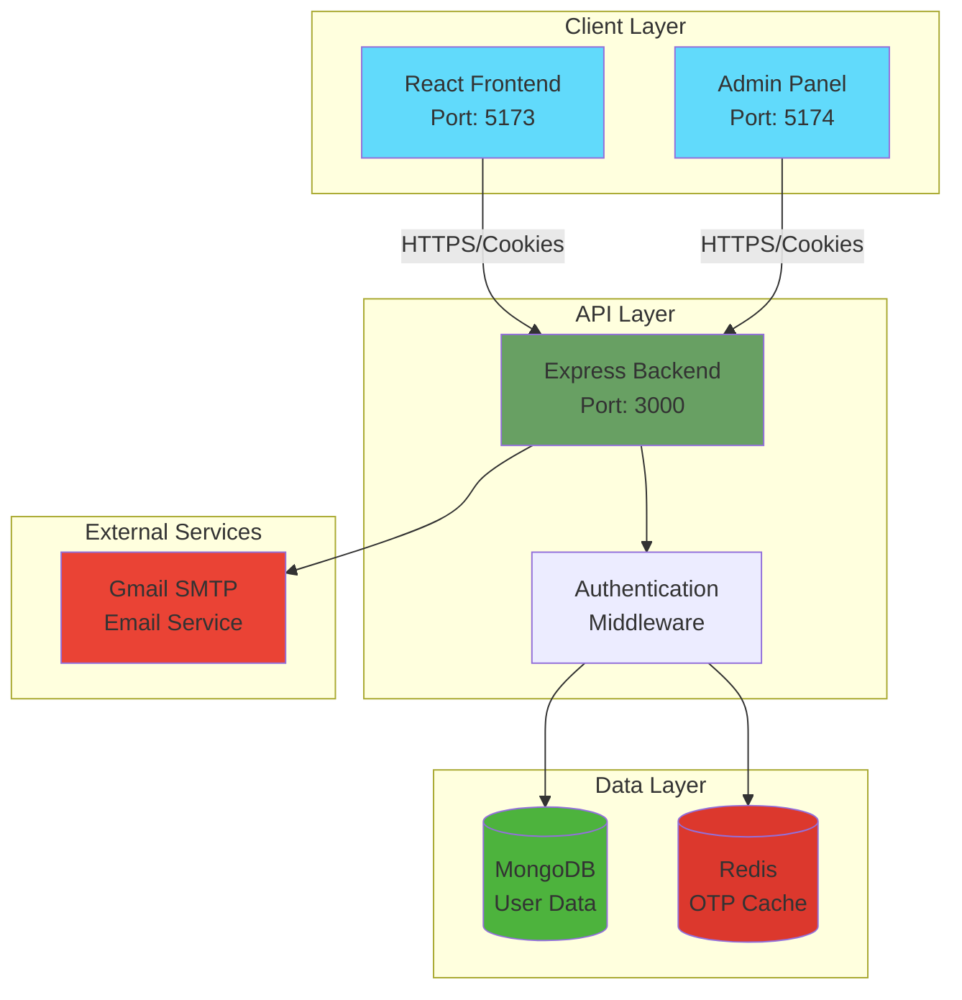

## 🔐 Authentication Flow Diagram

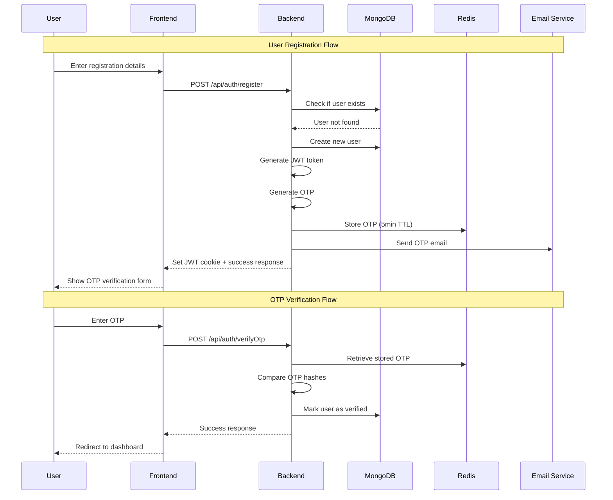

## 🛡️ Protected Route Flow

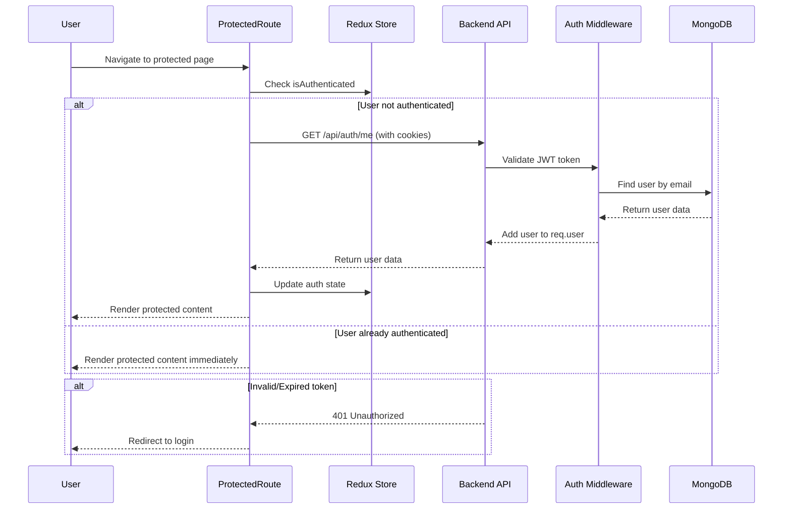

## 📊 Database Entity Relationship Diagram

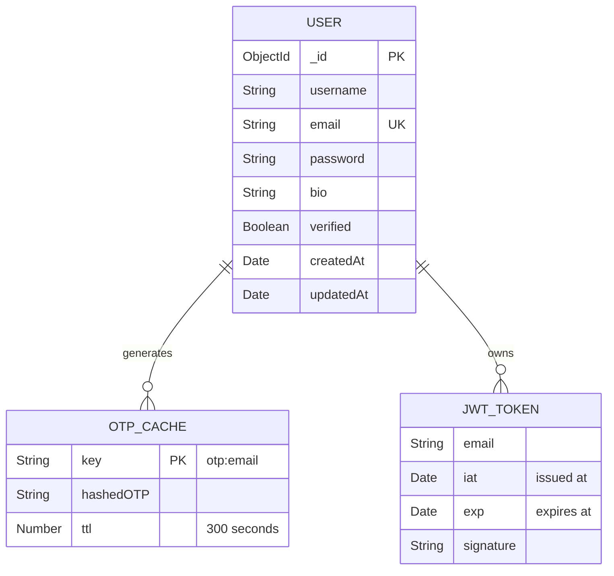

## 🎯 Frontend Component Architecture

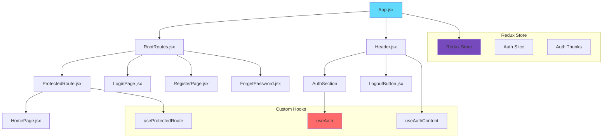

## 🔄 Redux State Flow

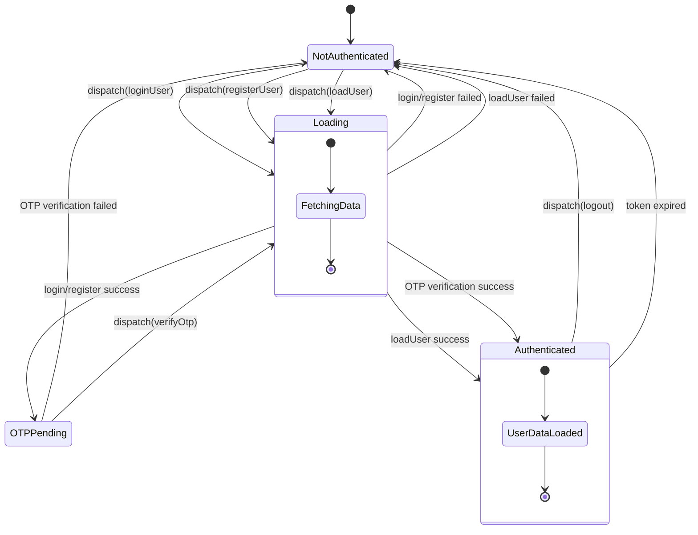

## 🌐 API Route Structure

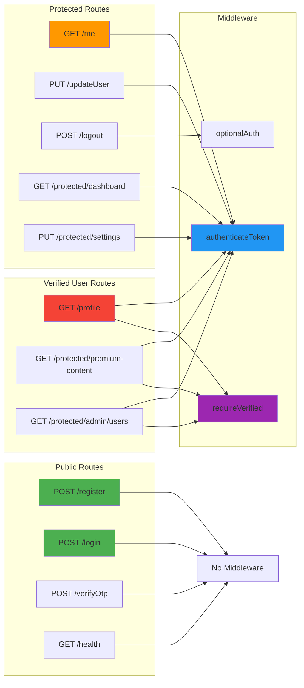

## 🔧 Backend Service Architecture

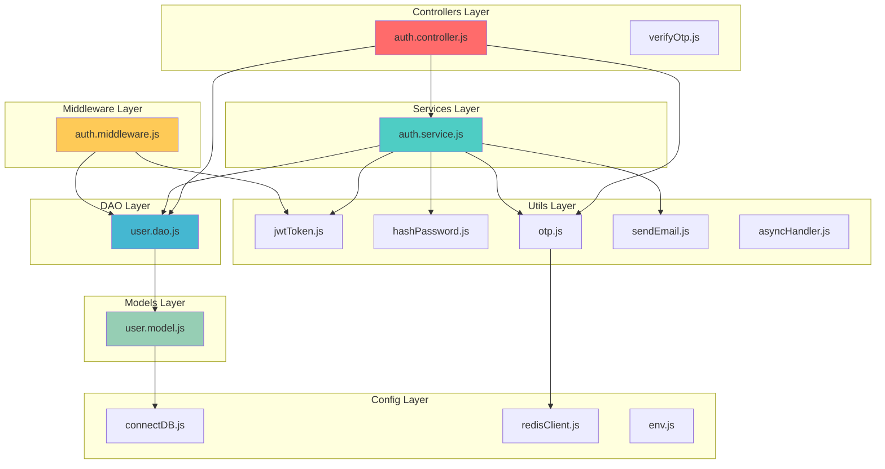

## 📱 User Journey Flow

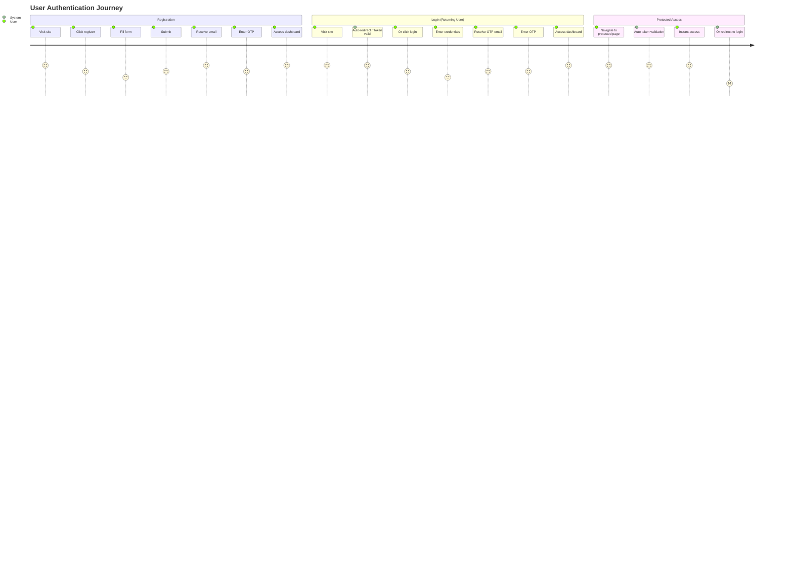

## 🔄 Data Flow Architecture

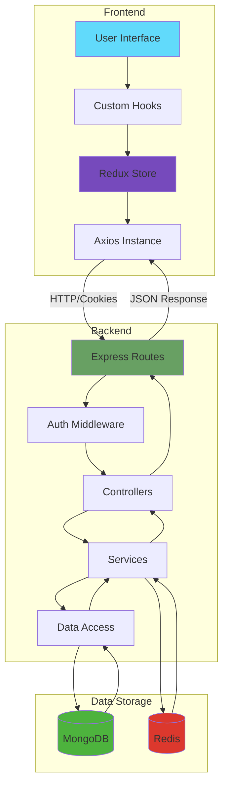

## 🔄 CI/CD Pipeline Architecture

```mermaid
graph TB
    subgraph "Source Control"
        GH[GitHub Repository]
        BRANCH[Feature Branch]
        PR[Pull Request]
        MAIN[Main Branch]
    end

    subgraph "CI Pipeline"
        TRIGGER[Webhook Trigger]
        LINT[ESLint & Prettier]
        TEST[Unit Tests]
        BUILD[Build Application]
        SECURITY[Security Scan]
        COVERAGE[Coverage Report]
    end

    subgraph "CD Pipeline"
        STAGING[Deploy to Staging]
        E2E[E2E Tests]
        APPROVAL[Manual Approval]
        PROD[Deploy to Production]
        MONITOR[Post-Deploy Monitoring]
    end

    subgraph "Deployment Targets"
        VERCEL[Vercel<br/>Frontend]
        RAILWAY[Railway<br/>Backend]
        ATLAS[MongoDB Atlas]
        REDIS_CLOUD[Redis Cloud]
    end

    BRANCH --> PR
    PR --> TRIGGER
    TRIGGER --> LINT
    LINT --> TEST
    TEST --> BUILD
    BUILD --> SECURITY
    SECURITY --> COVERAGE
    COVERAGE --> STAGING

    STAGING --> E2E
    E2E --> APPROVAL
    APPROVAL --> PROD
    PROD --> MONITOR

    STAGING --> VERCEL
    PROD --> VERCEL
    STAGING --> RAILWAY
    PROD --> RAILWAY

    style GH fill:#333
    style TRIGGER fill:#ff6b6b
    style PROD fill:#4caf50
    style MONITOR fill:#2196f3
```

## 🏗️ Microservices Evolution Architecture

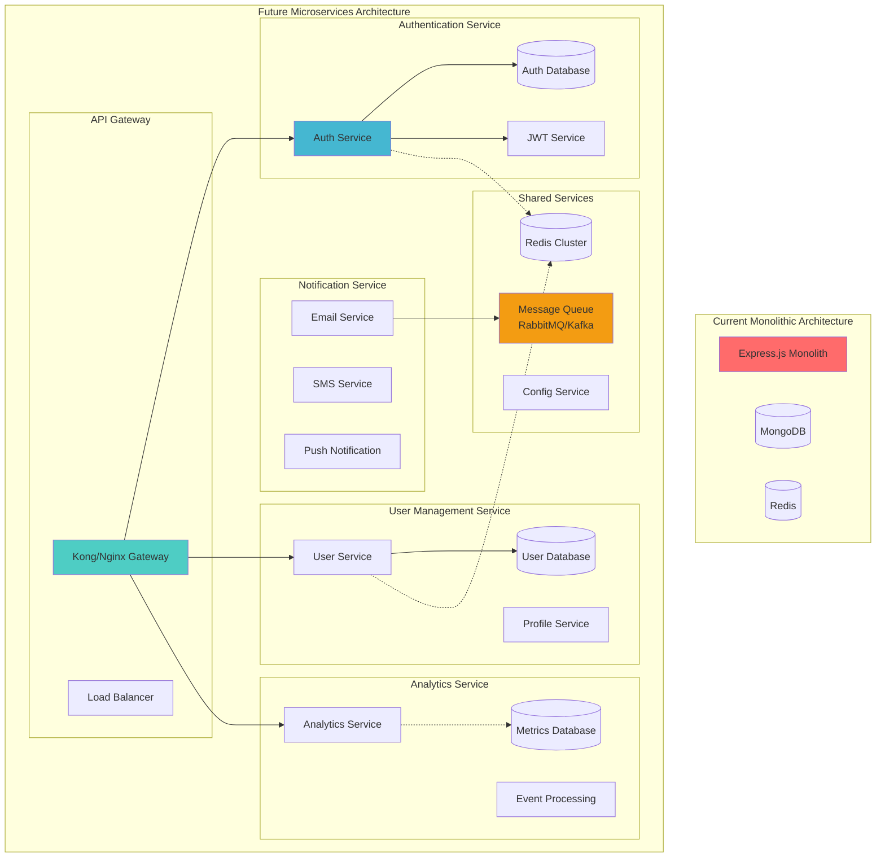

## 🌐 Global Deployment Architecture

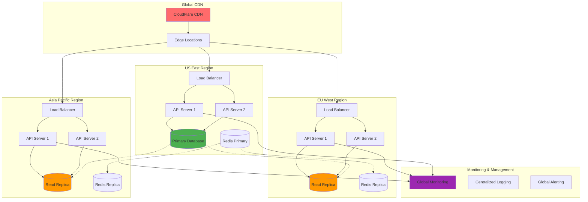

## 🔒 Zero-Trust Security Architecture

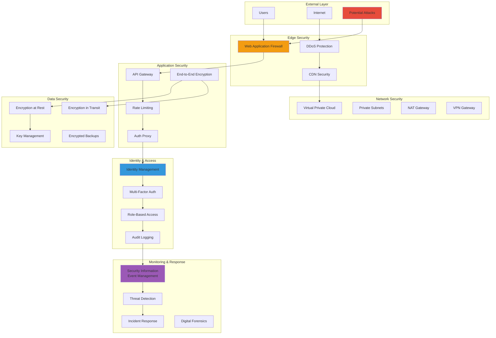

## 📊 Data Flow & Analytics Architecture

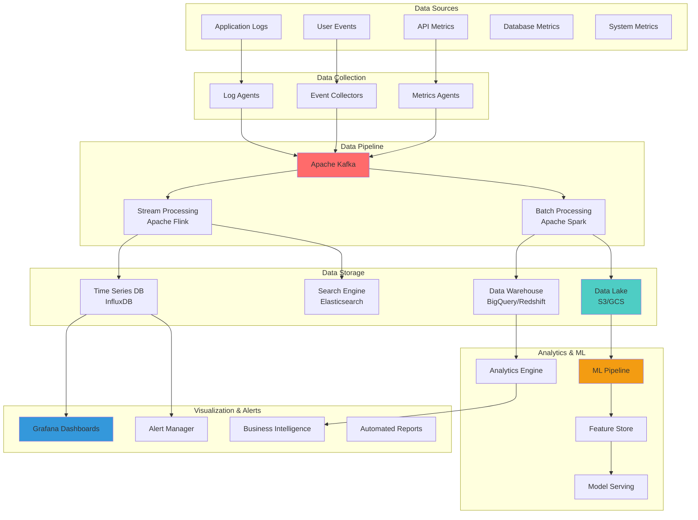

This comprehensive set of diagrams provides visual documentation for all major aspects of your IP Getter project architecture, from high-level system design to detailed component interactions, including future scalability considerations and advanced deployment patterns.
