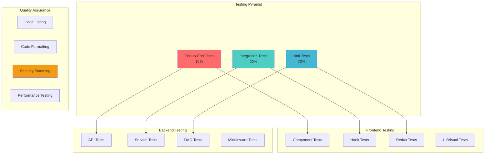
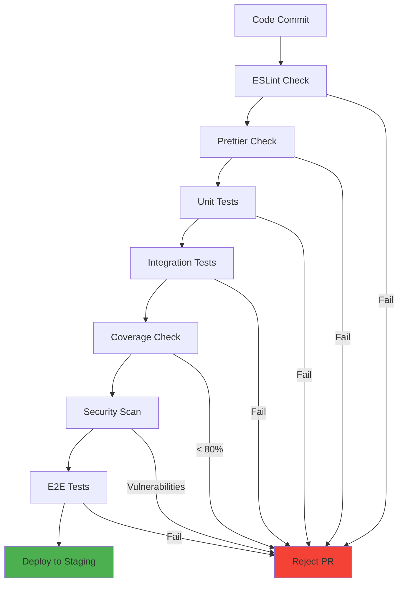

# 🧪 Testing Guide & Quality Assurance

## 🎯 Testing Strategy Overview

This guide covers comprehensive testing strategies, implementation patterns, and quality assurance practices for the IP Getter project.

## 🏗️ Testing Architecture



## 🔧 Testing Setup & Configuration

### Backend Testing Setup

#### Jest Configuration (`backend/jest.config.js`)
```javascript
module.exports = {
  testEnvironment: 'node',
  setupFilesAfterEnv: ['<rootDir>/tests/setup.js'],
  testMatch: [
    '<rootDir>/tests/**/*.test.js',
    '<rootDir>/src/**/*.test.js'
  ],
  collectCoverageFrom: [
    'src/**/*.js',
    '!src/server.js',
    '!src/config/**',
    '!**/node_modules/**'
  ],
  coverageThreshold: {
    global: {
      branches: 80,
      functions: 80,
      lines: 80,
      statements: 80
    }
  },
  coverageReporters: ['text', 'lcov', 'html'],
  verbose: true
};
```

#### Test Setup (`backend/tests/setup.js`)
```javascript
const mongoose = require('mongoose');
const { MongoMemoryServer } = require('mongodb-memory-server');
const Redis = require('ioredis-mock');

let mongoServer;

beforeAll(async () => {
  // Setup in-memory MongoDB
  mongoServer = await MongoMemoryServer.create();
  const mongoUri = mongoServer.getUri();
  await mongoose.connect(mongoUri);
  
  // Mock Redis
  jest.mock('../src/config/redisClient', () => new Redis());
});

afterAll(async () => {
  await mongoose.disconnect();
  await mongoServer.stop();
});

afterEach(async () => {
  // Clean up database after each test
  const collections = mongoose.connection.collections;
  for (const key in collections) {
    await collections[key].deleteMany({});
  }
});
```

### Frontend Testing Setup

#### Vitest Configuration (`frontend/vitest.config.js`)
```javascript
import { defineConfig } from 'vitest/config';
import react from '@vitejs/plugin-react';

export default defineConfig({
  plugins: [react()],
  test: {
    environment: 'jsdom',
    setupFiles: ['./src/tests/setup.js'],
    globals: true,
    coverage: {
      reporter: ['text', 'json', 'html'],
      exclude: [
        'node_modules/',
        'src/tests/',
        '**/*.d.ts',
      ],
      thresholds: {
        global: {
          branches: 80,
          functions: 80,
          lines: 80,
          statements: 80
        }
      }
    }
  }
});
```

#### React Testing Setup (`frontend/src/tests/setup.js`)
```javascript
import '@testing-library/jest-dom';
import { cleanup } from '@testing-library/react';
import { afterEach, vi } from 'vitest';

// Mock axios
vi.mock('../axios/apiInstance', () => ({
  default: {
    get: vi.fn(),
    post: vi.fn(),
    put: vi.fn(),
    delete: vi.fn(),
    interceptors: {
      request: { use: vi.fn() },
      response: { use: vi.fn() }
    }
  }
}));

// Cleanup after each test
afterEach(() => {
  cleanup();
  vi.clearAllMocks();
});
```

## 🧪 Unit Testing Patterns

### Backend Unit Tests

#### Service Layer Testing
```javascript
// tests/services/auth.service.test.js
const authService = require('../../src/services/auth.service');
const userDAO = require('../../src/dao/user.dao');
const bcrypt = require('bcryptjs');
const jwt = require('jsonwebtoken');

jest.mock('../../src/dao/user.dao');
jest.mock('bcryptjs');
jest.mock('jsonwebtoken');

describe('Auth Service', () => {
  beforeEach(() => {
    jest.clearAllMocks();
  });

  describe('registerUserService', () => {
    it('should register a new user successfully', async () => {
      // Arrange
      const userData = {
        username: 'testuser',
        email: 'test@example.com',
        password: 'password123'
      };
      
      userDAO.findUserByEmail.mockResolvedValue(null);
      userDAO.createUser.mockResolvedValue({ id: '123', ...userData });
      bcrypt.hash.mockResolvedValue('hashedPassword');
      jwt.sign.mockReturnValue('mockToken');

      // Act
      const result = await authService.registerUserService(
        userData.username,
        userData.email,
        userData.password
      );

      // Assert
      expect(userDAO.findUserByEmail).toHaveBeenCalledWith(userData.email);
      expect(bcrypt.hash).toHaveBeenCalledWith(userData.password, 12);
      expect(result).toHaveProperty('newUser');
      expect(result).toHaveProperty('token');
    });

    it('should throw error if user already exists', async () => {
      // Arrange
      userDAO.findUserByEmail.mockResolvedValue({ id: '123' });

      // Act & Assert
      await expect(
        authService.registerUserService('test', 'test@example.com', 'password')
      ).rejects.toThrow('User already exists');
    });
  });
});
```

#### Middleware Testing
```javascript
// tests/middlewares/auth.middleware.test.js
const authMiddleware = require('../../src/middlewares/auth.middleware');
const jwt = require('jsonwebtoken');
const userDAO = require('../../src/dao/user.dao');

jest.mock('jsonwebtoken');
jest.mock('../../src/dao/user.dao');

describe('Auth Middleware', () => {
  let req, res, next;

  beforeEach(() => {
    req = {
      cookies: {},
      user: null
    };
    res = {
      status: jest.fn().mockReturnThis(),
      json: jest.fn()
    };
    next = jest.fn();
  });

  describe('authenticateToken', () => {
    it('should authenticate valid token', async () => {
      // Arrange
      req.cookies.token = 'validToken';
      jwt.verify.mockReturnValue({ email: 'test@example.com' });
      userDAO.findUserByEmail.mockResolvedValue({ 
        id: '123', 
        email: 'test@example.com' 
      });

      // Act
      await authMiddleware.authenticateToken(req, res, next);

      // Assert
      expect(req.user).toBeDefined();
      expect(next).toHaveBeenCalled();
    });

    it('should reject invalid token', async () => {
      // Arrange
      req.cookies.token = 'invalidToken';
      jwt.verify.mockImplementation(() => {
        throw new Error('Invalid token');
      });

      // Act
      await authMiddleware.authenticateToken(req, res, next);

      // Assert
      expect(res.status).toHaveBeenCalledWith(401);
      expect(res.json).toHaveBeenCalledWith({
        success: false,
        message: 'Invalid token format.'
      });
    });
  });
});
```

### Frontend Unit Tests

#### Component Testing
```javascript
// src/components/__tests__/Header.test.jsx
import { render, screen, fireEvent } from '@testing-library/react';
import { Provider } from 'react-redux';
import { BrowserRouter } from 'react-router-dom';
import { configureStore } from '@reduxjs/toolkit';
import Header from '../Header';
import authSlice from '../../redux/auth/authSlice';

const createMockStore = (initialState) => {
  return configureStore({
    reducer: {
      auth: authSlice
    },
    preloadedState: initialState
  });
};

const renderWithProviders = (component, initialState = {}) => {
  const store = createMockStore(initialState);
  return render(
    <Provider store={store}>
      <BrowserRouter>
        {component}
      </BrowserRouter>
    </Provider>
  );
};

describe('Header Component', () => {
  it('should render login button when not authenticated', () => {
    const initialState = {
      auth: {
        user: null,
        isAuthenticated: false,
        loading: false
      }
    };

    renderWithProviders(<Header />, initialState);
    
    expect(screen.getByText('Login')).toBeInTheDocument();
    expect(screen.getByText('Register')).toBeInTheDocument();
  });

  it('should render user info when authenticated', () => {
    const initialState = {
      auth: {
        user: { username: 'testuser', email: 'test@example.com' },
        isAuthenticated: true,
        loading: false
      }
    };

    renderWithProviders(<Header />, initialState);
    
    expect(screen.getByText('testuser')).toBeInTheDocument();
    expect(screen.getByText('Logout')).toBeInTheDocument();
  });
});
```

#### Hook Testing
```javascript
// src/hooks/__tests__/useAuth.test.js
import { renderHook, act } from '@testing-library/react';
import { Provider } from 'react-redux';
import { configureStore } from '@reduxjs/toolkit';
import useAuth from '../useAuth';
import authSlice from '../../redux/auth/authSlice';

const createWrapper = (initialState) => {
  const store = configureStore({
    reducer: { auth: authSlice },
    preloadedState: initialState
  });
  
  return ({ children }) => (
    <Provider store={store}>{children}</Provider>
  );
};

describe('useAuth Hook', () => {
  it('should return authentication state', () => {
    const initialState = {
      auth: {
        user: { username: 'testuser' },
        isAuthenticated: true,
        loading: false
      }
    };

    const wrapper = createWrapper(initialState);
    const { result } = renderHook(() => useAuth(), { wrapper });

    expect(result.current.user).toEqual({ username: 'testuser' });
    expect(result.current.isAuthenticated).toBe(true);
    expect(result.current.loading).toBe(false);
  });
});
```

## 🔗 Integration Testing

### API Integration Tests
```javascript
// tests/integration/auth.integration.test.js
const request = require('supertest');
const app = require('../../src/app');
const User = require('../../src/models/user.model');

describe('Auth Integration Tests', () => {
  describe('POST /api/auth/register', () => {
    it('should register a new user and send OTP', async () => {
      const userData = {
        username: 'testuser',
        email: 'test@example.com',
        password: 'Password123!'
      };

      const response = await request(app)
        .post('/api/auth/register')
        .send(userData)
        .expect(201);

      expect(response.body.message).toBe('User created successfully');
      expect(response.body.newUser.newUser.email).toBe(userData.email);
      
      // Verify user was created in database
      const user = await User.findOne({ email: userData.email });
      expect(user).toBeTruthy();
      expect(user.verified).toBe(false);
    });

    it('should return error for duplicate email', async () => {
      // Create user first
      await User.create({
        username: 'existing',
        email: 'existing@example.com',
        password: 'hashedPassword'
      });

      const response = await request(app)
        .post('/api/auth/register')
        .send({
          username: 'newuser',
          email: 'existing@example.com',
          password: 'Password123!'
        })
        .expect(400);

      expect(response.body.message).toBe('User already exists');
    });
  });

  describe('POST /api/auth/login', () => {
    beforeEach(async () => {
      // Create verified user for login tests
      await User.create({
        username: 'loginuser',
        email: 'login@example.com',
        password: await bcrypt.hash('Password123!', 12),
        verified: true
      });
    });

    it('should login with valid credentials', async () => {
      const response = await request(app)
        .post('/api/auth/login')
        .send({
          email: 'login@example.com',
          password: 'Password123!'
        })
        .expect(200);

      expect(response.body.message).toBe('Logged in');
      expect(response.headers['set-cookie']).toBeDefined();
    });
  });
});
```

## 🎭 End-to-End Testing

### E2E Test Setup (Playwright)
```javascript
// e2e/auth.e2e.test.js
const { test, expect } = require('@playwright/test');

test.describe('Authentication Flow', () => {
  test.beforeEach(async ({ page }) => {
    await page.goto('http://localhost:5173');
  });

  test('should complete full registration and login flow', async ({ page }) => {
    // Navigate to register
    await page.click('text=Register');
    
    // Fill registration form
    await page.fill('[data-testid=username]', 'e2euser');
    await page.fill('[data-testid=email]', 'e2e@example.com');
    await page.fill('[data-testid=password]', 'Password123!');
    await page.click('[data-testid=register-button]');
    
    // Should show OTP verification
    await expect(page.locator('text=Enter OTP')).toBeVisible();
    
    // Mock OTP verification (in real test, you'd get OTP from test email)
    await page.fill('[data-testid=otp]', '123456');
    await page.click('[data-testid=verify-button]');
    
    // Should redirect to dashboard
    await expect(page.locator('text=Welcome')).toBeVisible();
    
    // Logout
    await page.click('[data-testid=logout-button]');
    
    // Should redirect to login
    await expect(page.locator('text=Login')).toBeVisible();
  });

  test('should persist authentication across page refresh', async ({ page }) => {
    // Login first
    await page.click('text=Login');
    await page.fill('[data-testid=email]', 'existing@example.com');
    await page.fill('[data-testid=password]', 'Password123!');
    await page.click('[data-testid=login-button]');
    
    // Verify OTP and reach dashboard
    await page.fill('[data-testid=otp]', '123456');
    await page.click('[data-testid=verify-button]');
    await expect(page.locator('text=Welcome')).toBeVisible();
    
    // Refresh page
    await page.reload();
    
    // Should still be authenticated
    await expect(page.locator('text=Welcome')).toBeVisible();
  });
});
```

## 📊 Test Coverage & Quality Metrics

### Coverage Configuration
```javascript
// Coverage thresholds
const coverageThresholds = {
  global: {
    branches: 80,
    functions: 80,
    lines: 80,
    statements: 80
  },
  './src/services/': {
    branches: 90,
    functions: 90,
    lines: 90,
    statements: 90
  },
  './src/middlewares/': {
    branches: 85,
    functions: 85,
    lines: 85,
    statements: 85
  }
};
```

### Quality Gates


## 🚀 Running Tests

### Backend Tests
```bash
# Run all tests
npm test

# Run tests with coverage
npm run test:coverage

# Run tests in watch mode
npm run test:watch

# Run specific test file
npm test -- auth.service.test.js

# Run integration tests only
npm run test:integration
```

### Frontend Tests
```bash
# Run all tests
npm run test

# Run tests with coverage
npm run test:coverage

# Run tests in watch mode
npm run test:watch

# Run specific test
npm run test -- Header.test.jsx

# Run E2E tests
npm run test:e2e
```

## 🔧 Test Utilities & Helpers

### Test Data Factory
```javascript
// tests/factories/userFactory.js
const faker = require('faker');

const createUser = (overrides = {}) => ({
  username: faker.internet.userName(),
  email: faker.internet.email(),
  password: 'Password123!',
  bio: faker.lorem.sentence(),
  verified: false,
  ...overrides
});

const createVerifiedUser = (overrides = {}) => 
  createUser({ verified: true, ...overrides });

module.exports = {
  createUser,
  createVerifiedUser
};
```

### API Test Helpers
```javascript
// tests/helpers/apiHelpers.js
const request = require('supertest');
const app = require('../../src/app');

const registerUser = async (userData) => {
  return request(app)
    .post('/api/auth/register')
    .send(userData);
};

const loginUser = async (credentials) => {
  return request(app)
    .post('/api/auth/login')
    .send(credentials);
};

const getAuthenticatedAgent = async (userCredentials) => {
  const agent = request.agent(app);
  await agent
    .post('/api/auth/login')
    .send(userCredentials);
  return agent;
};

module.exports = {
  registerUser,
  loginUser,
  getAuthenticatedAgent
};
```

## 📈 Performance Testing

### Load Testing with Artillery
```yaml
# artillery.yml
config:
  target: 'http://localhost:3000'
  phases:
    - duration: 60
      arrivalRate: 10
    - duration: 120
      arrivalRate: 20
    - duration: 60
      arrivalRate: 5

scenarios:
  - name: "Authentication Flow"
    weight: 70
    flow:
      - post:
          url: "/api/auth/login"
          json:
            email: "test@example.com"
            password: "Password123!"
      - get:
          url: "/api/auth/me"

  - name: "Registration Flow"
    weight: 30
    flow:
      - post:
          url: "/api/auth/register"
          json:
            username: "{{ $randomString() }}"
            email: "{{ $randomString() }}@example.com"
            password: "Password123!"
```

This comprehensive testing guide provides the foundation for maintaining high code quality and reliability in your IP Getter application.
