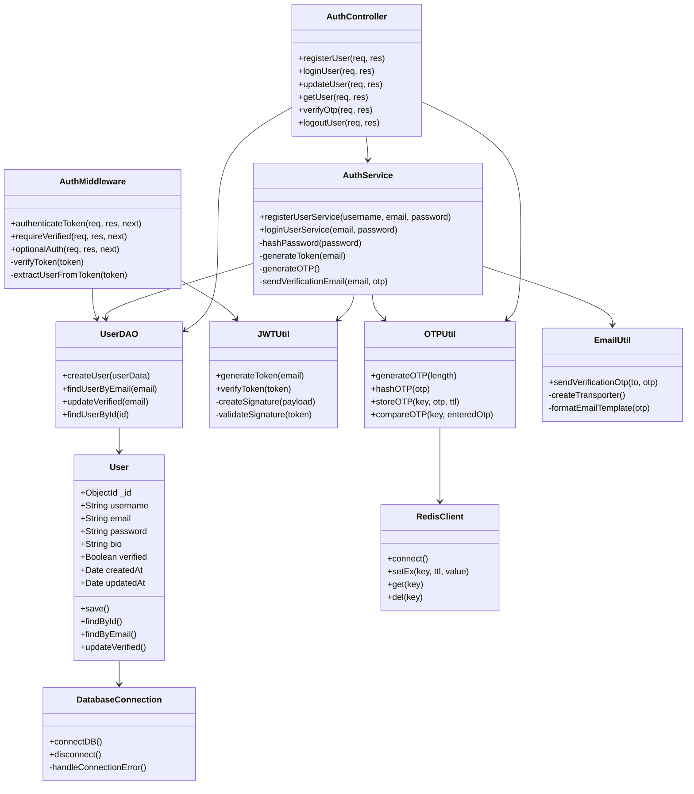
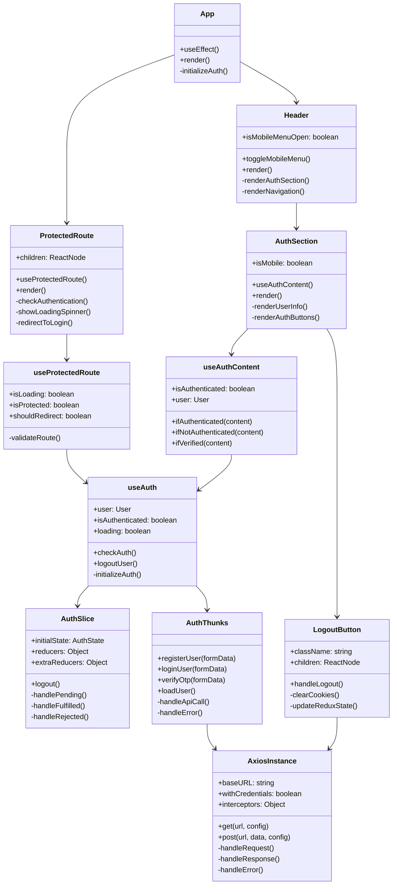
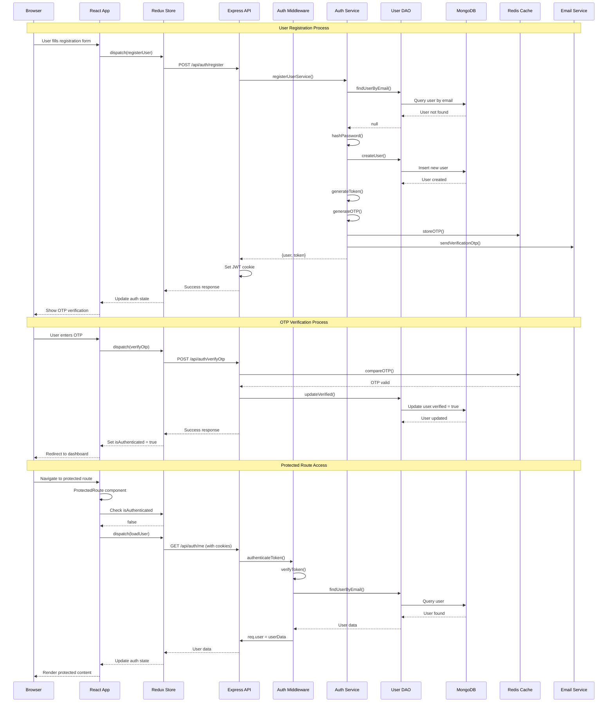
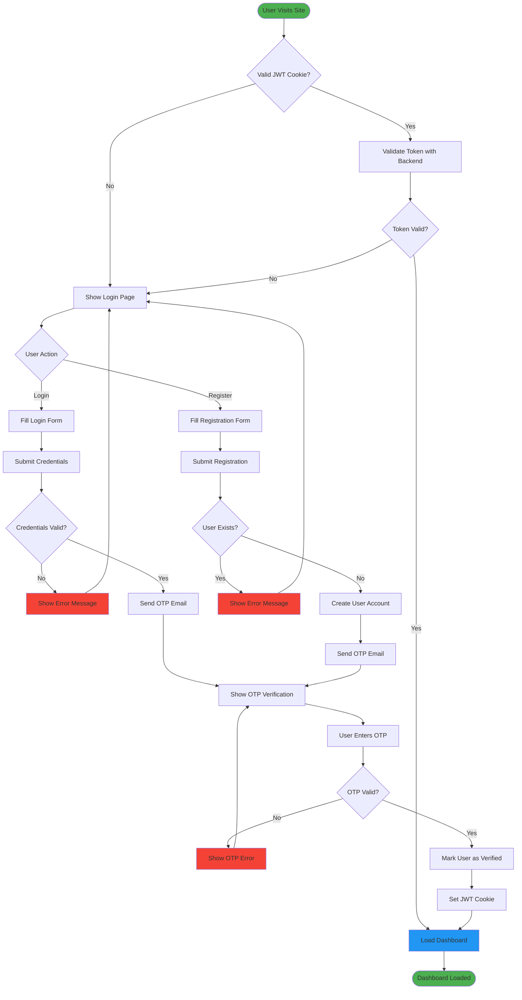
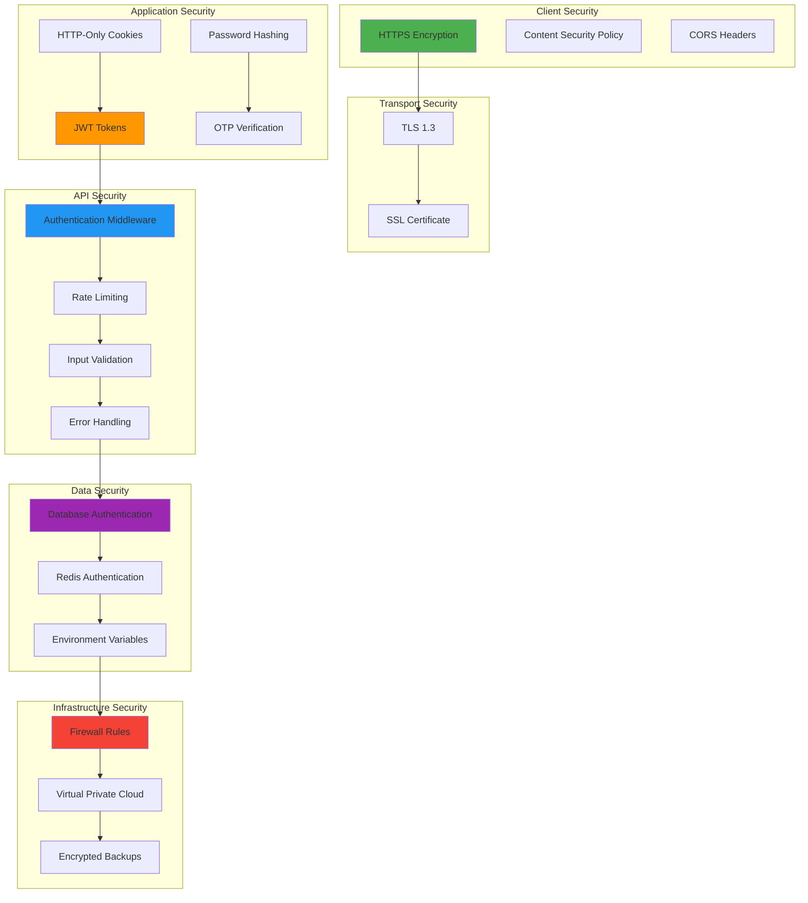
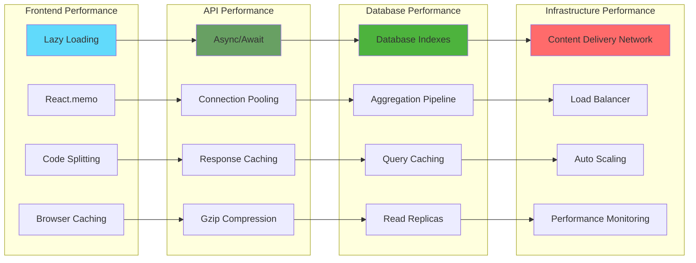

# 🎯 UML Diagrams & Technical Architecture

## 📋 Class Diagram - Backend Architecture



## 🎨 Component Diagram - Frontend Architecture



## 🔄 Sequence Diagram - Complete Authentication Flow



## 🏗️ Deployment Diagram

```mermaid
deployment
    node "Client Browser" {
        component "React App" as ReactApp
        component "Redux Store" as ReduxStore
        artifact "JWT Cookie" as Cookie
    }
    
    node "CDN/Static Hosting" {
        component "Vite Build" as ViteBuild
        artifact "Static Assets" as Assets
    }
    
    node "API Server" {
        component "Express.js" as Express
        component "Auth Middleware" as AuthMW
        component "Controllers" as Controllers
        component "Services" as Services
    }
    
    node "Database Server" {
        database "MongoDB" as MongoDB
        database "Redis Cache" as Redis
    }
    
    node "Email Service" {
        component "Gmail SMTP" as SMTP
    }
    
    node "Monitoring" {
        component "Health Checks" as Health
        component "Error Logging" as Logging
    }
    
    ReactApp --> ViteBuild : "Build Process"
    ReactApp --> Express : "HTTPS/API Calls"
    Cookie --> Express : "Authentication"
    
    Express --> AuthMW : "Request Processing"
    AuthMW --> Controllers : "Authorized Requests"
    Controllers --> Services : "Business Logic"
    
    Services --> MongoDB : "User Data"
    Services --> Redis : "OTP Storage"
    Services --> SMTP : "Email Notifications"
    
    Express --> Health : "Status Monitoring"
    Express --> Logging : "Error Tracking"
```

## 📊 Activity Diagram - User Authentication Journey



## 🔐 Security Architecture Diagram



## 📈 Performance Architecture



These UML diagrams provide comprehensive technical documentation covering class structures, component relationships, sequence flows, deployment architecture, security measures, and performance considerations for your IP Getter project.
